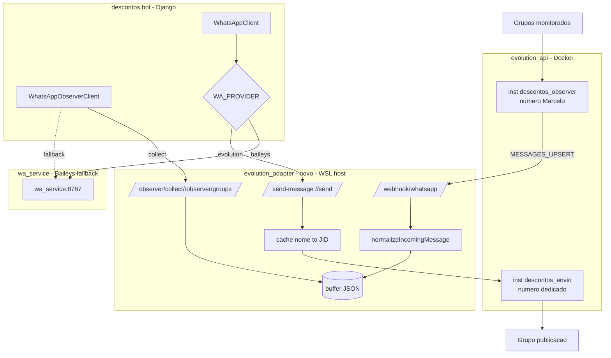

# Plano de Migração — wa_service/Baileys → evolution_api

> Status: **Sprints 0–3 executadas e validadas em homologação**. Cutover produção/descomissionamento ficam na Sprint 4.
> Repositórios: `descontos.bot` (consumidor) e `evolution_api` (provedor).

## 1. Análise do estado atual

**descontos.bot (consumidor).** Django + microserviço Node `wa_service/` (Baileys, porta 8787). Envio: `WhatsAppClient` (`apps/distribution/services/whatsapp_client.py`, `base_url` configurável) → `POST /send-message` e `/send`. Suporta texto + imagem (caption). Alvo por **nome de grupo** → JID (`resolveGroupJid`). Observer: **pull**. `wa_service` escuta `messages.upsert`, normaliza 24 campos (`normalizeIncomingMessage` em `observer.ts`), bufferiza JSON; Django coleta via `POST /observer/collect` (`whatsapp_observer_client.py` + management command). Hoje **um número faz envio+observação**. Feature-flag natural: `ALLOW_PRODUCTION_WHATSAPP_SEND`.

**evolution_api (provedor).** Wrapper Docker da imagem `evoapicloud/evolution-api:v2.3.4` (+ Postgres + Redis). Multi-instância por nome. Envio: `POST /message/sendText/{instance}` `{number,text}` e `POST /message/sendMedia/{instance}` `{number,mediatype,mimetype,caption,media,fileName}`. Observer: **webhook push por instância** (`POST /webhook/set/{instance}`, evento `MESSAGES_UPSERT`), retry exponencial. Auth: header `apikey` (global + token/instância). Sem assinatura de webhook nativa.

**Reconciliação — lacunas:**

| # | descontos.bot precisa | Evolution dá | Ação |
|---|---|---|---|
| R1 | envio por nome de grupo | exige JID (`number`) | resolver nome→JID 1x, armazenar, enviar por JID (**D6**) |
| R2 | imagem | `media`=url ou base64 | usar `media`=url pública (**D7**) |
| R3 | observer pull `/observer/collect` + schema 24 campos | webhook push, payload incerto | adapter recebe webhook, normaliza, expõe **mesma interface pull** (**D3**) |
| R4 | `sender_hash`,`urls`,`group_subject` | payload bruto Baileys-via-Evolution | reusar lógica `normalizeIncomingMessage` no adapter |
| R5 | dois papéis fixos | duas instâncias nomeadas | `descontos_envio` / `descontos_observer` em config (**D1**) |
| R6 | webhook alcançável | Evolution faz POST de saída | adapter no WSL fora do Docker; Evolution→host via `host.docker.internal` |

**Pendência de runtime resolvida:** formato real do payload `MESSAGES_UPSERT` validado na v2.3.4 durante a Sprint 0.

---

## 2. Arquitetura-alvo

Princípio: **adapter novo** que fala o **mesmo contrato** do `wa_service` (`/send-message`, `/send`, `/observer/collect`, `/observer/groups`) + `/webhook/whatsapp`. Django troca só `base_url` por feature flag. wa_service/Baileys fica intacto como fallback. Reuso máximo: `normalizeIncomingMessage` (observer.ts) migra pro adapter.

**Diagrama textual:**

```
ENVIO
  Django (WhatsAppClient, base_url via WA_PROVIDER)
    └─ WA_PROVIDER=evolution → POST /send-message → [evolution_adapter]
                                                        └─ map nome→JID (cache)
                                                        └─ POST /message/sendText|sendMedia/descontos_envio
                                                              → Evolution (Docker) → número dedicado → grupo publicação
    └─ WA_PROVIDER=baileys (fallback) → POST /send-message → [wa_service:8787] → Baileys

RECEBIMENTO (observer)
  grupos monitorados → número Marcelo (descontos_observer) → Evolution (Docker)
    └─ webhook MESSAGES_UPSERT → POST host.docker.internal:<porta>/webhook/whatsapp → [evolution_adapter]
          └─ normalizeIncomingMessage → buffer JSON
  Django (WhatsAppObserverClient, base_url via WA_PROVIDER)
    └─ POST /observer/collect → [evolution_adapter] (mesmo contrato do wa_service)
```

**Mermaid:**



---

## 3. Plano de atividades faseado

Convenção: identificadores de domínio em snake_case pt-BR (`instancia_envio`, `instancia_observer`, `numero_dedicado`, `evento_recebido`, `mapa_papel_instancia`, `mapa_grupos`).

### Sprint 0 — Fundação e validação (paralelo nos dois repos)

| ID | Atividade | Projeto | Dep | Critério conclusão |
|----|-----------|---------|-----|--------------------|
| S0.1 | Subir stack Evolution local; criar/parear `descontos_envio` (número atual) e `descontos_observer` (Marcelo); QR via scripts | evolution_api | — | 2 instâncias `connectionState=open` |
| S0.2 | Configurar `webhook/set` na `descontos_observer` apontando p/ endpoint teste; **capturar payload real `MESSAGES_UPSERT`** e documentar | evolution_api | S0.1 | payload exemplo salvo; mapa campos→schema 24 definido |
| S0.3 | Resolver nome→JID dos grupos via Evolution; gerar `mapa_grupos` (nome→JID) | evolution_api | S0.1 | JIDs do grupo publicação + grupos monitorados confirmados |
| S0.4 | Levantar contrato atual wa_service e congelar como interface-alvo do adapter | descontos.bot | — | doc de contrato `/send-message`,`/send`,`/observer/*` |

*S0.4 paraleliza com S0.1–S0.3.*

### Sprint 1 — Adapter (envio)

| ID | Atividade | Projeto | Dep | Critério |
|----|-----------|---------|-----|----------|
| S1.1 | Criar serviço `evolution_adapter` (Node, reuso da base HTTP do wa_service) sem Baileys | descontos.bot | S0.4 | sobe em porta dedicada, `/health` ok |
| S1.2 | Impl `/send-message` + `/send` → `sendText`/`sendMedia` na `descontos_envio`; imagem via `media`=URL (D7) | descontos.bot | S1.1, S0.3 | envio texto+imagem ao grupo **homologação** ok |
| S1.3 | Impl resolução/armazenamento nome→JID (`mapa_grupos`) usado no envio | descontos.bot | S0.3 | envio aceita nome e resolve JID |
| S1.4 | Auth: header `apikey` via env; nenhuma credencial hardcoded | descontos.bot | S1.1 | chamadas autenticadas, segredo só em env |

### Sprint 2 — Adapter (observer)

| ID | Atividade | Projeto | Dep | Critério |
|----|-----------|---------|-----|----------|
| S2.1 | Impl `/webhook/whatsapp` recebendo `MESSAGES_UPSERT`; mapear payload Evolution→entrada de `normalizeIncomingMessage` (reuso) | descontos.bot | S0.2, S1.1 | webhook grava no buffer |
| S2.2 | Reusar buffer JSON + `/observer/collect` + `/observer/groups` (mesmo contrato) | descontos.bot | S2.1 | `collect` devolve schema 24 campos idêntico |
| S2.3 | Idempotência/dedup por `message_id`; ordenação por `sent_at` | descontos.bot | S2.1 | reentrega do Evolution não duplica |
| S2.4 | Filtro allowlist de grupos (`numero_observer` só grupos monitorados) | descontos.bot | S2.2 | só JIDs allowlisted entram |

### Sprint 3 — Integração Django + feature flag

| ID | Atividade | Projeto | Dep | Critério |
|----|-----------|---------|-----|----------|
| S3.1 | Feature flag `WA_PROVIDER` (`baileys`\|`evolution`) selecionando `base_url` em `WhatsAppClient` e `WhatsAppObserverClient` | descontos.bot | S1.2, S2.2 | flag alterna provedor sem refactor de chamadas |
| S3.2 | Mapa `mapa_papel_instancia` em config (`instancia_envio=descontos_envio`, `instancia_observer=descontos_observer`) — sem valores fixos no código | descontos.bot | S3.1 | papéis parametrizados por env |
| S3.3 | Teste E2E homologação: envio→grupo homolog + observer→collect com flag=`evolution` | descontos.bot | S3.1, S3.2 | paridade funcional vs Baileys |

### Sprint 4 — Cutover e descomissionamento

| ID | Atividade | Projeto | Dep | Critério |
|----|-----------|---------|-----|----------|
| S4.1 | Cutover produção: `WA_PROVIDER=evolution` em janela de envio | descontos.bot | S3.3 | envio+observer prod ok 1 ciclo |
| S4.2 | Monitorar 1–2 ciclos com Baileys de prontidão (rollback = flip flag) | descontos.bot | S4.1 | estável, sem perda de eventos |
| S4.3 | Descomissionar wa_service/Baileys (D5/D11) | descontos.bot | S4.2 | wa_service desligado, sessão arquivada |
| S4.4 | Atualizar PRDs ambos repos (corrigir premissa "descontos.bot não precisa webhook") | ambos | S4.1 | PRDs refletem arquitetura nova |

**Paralelização:** Sprint 0 roda nos dois repos junto. evolution_api só atua em S0.1–S0.3 (config/instâncias/webhook) — resto é descontos.bot. S1 (envio) e S2 (observer) podem correr em paralelo após S1.1 criar o serviço base.

---

## 4. Estratégia de migração e cutover

- **Coexistência:** wa_service/Baileys intacto. `evolution_adapter` é serviço **novo** e separado. Mesmo contrato → Django não muda chamadas, só `base_url`.
- **Feature flag:** `WA_PROVIDER=baileys|evolution`. Default `baileys` até validação. Aplica a envio E observer.
- **Rollout:** validar primeiro no **grupo de homologação WhatsApp** (D9); só depois grupo produção.
- **Janela:** downtime tolerado — envio em janelas de 90–180min (D8). Cutover dentro de janela.
- **Rollback:** flip `WA_PROVIDER=baileys` + religar wa_service. Reversível a qualquer momento até S4.3.
- **Critérios objetivos de rollback:** falha de envio >X%, eventos perdidos no observer, payload `MESSAGES_UPSERT` divergente do schema, ou `connectionState != open`.

---

## 5. Configuração necessária

Apenas **produção** (validada via grupo homologação). Segredos só em env / cofre externo — nunca versionados. Placeholder `<ver cofre: evolution-api>`.

**evolution_api (já existe):** `AUTHENTICATION_API_KEY`, `SERVER_PORT`, `SERVER_URL`, `POSTGRES_*`, `WEBHOOK_RETRY_*`.

**descontos.bot — novas (adapter + flag):**

| Variável | Função |
|----------|--------|
| `WA_PROVIDER` | `baileys`\|`evolution` |
| `EVOLUTION_BASE_URL` | URL base Evolution (Docker, ex. `http://localhost:8081`) |
| `EVOLUTION_API_KEY` | header `apikey` (cofre) |
| `EVOLUTION_INSTANCIA_ENVIO` | `descontos_envio` |
| `EVOLUTION_INSTANCIA_OBSERVER` | `descontos_observer` |
| `EVOLUTION_ADAPTER_URL` | base_url do adapter (Django aponta aqui qd `evolution`) |
| `EVOLUTION_ADAPTER_PORT` | porta do adapter no WSL |
| `EVOLUTION_WEBHOOK_PATH` | `/webhook/whatsapp` |
| `WA_OBSERVER_GROUP_JIDS` | reaproveitar — allowlist (agora JIDs resolvidos) |
| `WA_OBSERVER_SENDER_HASH_SALT` | reaproveitar — mantém hash compatível |

Webhook Evolution(Docker)→adapter(WSL host): `host.docker.internal:<EVOLUTION_ADAPTER_PORT>/webhook/whatsapp`.

**Segurança (D10/D11):** mesmo host, sem HMAC. Mitigação mínima: bind do adapter em loopback/IP WSL, não exposto à rede externa.

---

## 6. Riscos e pontos de atenção

Riscos genuínos (ameaças). Onde a mitigação já é uma decisão, referencia o ID em vez de repetir.

| Risco | Mitigação |
|-------|-----------|
| Payload `MESSAGES_UPSERT` divergir do schema esperado | S0.2 valida e documenta o mapeamento ANTES de codar (ver D5) |
| Reentrega de webhook duplica eventos | dedup por `message_id` + ordenação por `sent_at` (S2.3) |
| `numero_observer` (Marcelo) sair dos grupos ou desconectar → observer para | **dependência operacional**: monitorar `connectionState`; alertar se `!= open` |
| `host.docker.internal` não resolver no WSL | validar conectividade Docker→host em S0.2; fallback IP do host WSL |
| Segredo em texto plano | `.env` do evolution_api contém `apikey`/token — garantir `.env` fora do git; **rotacionar se já versionado** |
| Grupo renomeado invalida `mapa_grupos` (nome→JID) | `mapa_grupos` atualizável; re-resolver sob demanda (mecanismo de D6) |
| Falha no cutover (envio/observer) | janela de downtime tolerada + Baileys de prontidão; rollback = flip flag (mecanismo de D8/D11) |

*Roteamento de papéis e segurança de host não entram como risco — tratados por D1/D10 (seção 7).*

---

## 7. Registro de decisões

Cada decisão = escolha + justificativa. Sem restatement de risco.

- **D1** Duas instâncias: `descontos_envio` (número atual wa_service) e `descontos_observer` (número Marcelo). *Papéis fixos, números físicos distintos; envio nunca sai pela instância errada por config, não por código.*
- **D2** Sem instâncias adicionais previstas; roteamento por config simples, porém extensível.
- **D3** Observer = bridge de compatibilidade (opção a): adapter mantém interface pull `/observer/collect`. *Mudança mínima no Django; incremental e reversível.*
- **D4** Adapter no WSL fora do Docker, mesmo host; Evolution faz POST para o host.
- **D5** Validar payload subindo stack local; depois descontinuar wa_service.
- **D6** Envio por JID: resolver nome→JID 1x, armazenar (`mapa_grupos`), usar JID.
- **D7** Imagem via URL pública (já salva na oferta) → `sendMedia media=url`.
- **D8** Coexistência via flag `WA_PROVIDER`; downtime tolerado (janelas 90–180min); rollback = flip flag.
- **D9** Só produção; validação via grupo homologação WhatsApp.
- **D10** Sem HMAC/HTTPS extra (mesmo host); adapter com bind restrito (loopback/IP WSL).
- **D11** wa_service mantido como fallback; descomissionado ao final.
- **D12** Atualizar PRDs dos dois repos pós-aprovação.

---

## 8. Critérios de aceite / Definição de pronto

1. `descontos_envio` e `descontos_observer` ativas (`connectionState=open`).
2. Envio **texto** e **imagem** pela `descontos_envio` ao grupo homologação — paridade com Baileys.
3. Observer: `MESSAGES_UPSERT` → `/observer/collect` devolve **schema 24 campos idêntico** (incl. `sender_hash`, `urls`, `group_subject`).
4. Dedup: reentrega não gera duplicata.
5. Flag `WA_PROVIDER` alterna provedor sem alterar chamadas Django; rollback testado.
6. `mapa_papel_instancia` parametrizado por env — zero valor fixo no código.
7. Nenhum segredo em código/versionado; tudo em env/cofre.
8. 1+ ciclo de produção (envio + observer) estável com `evolution`.
9. wa_service descomissionado.
10. PRDs dos dois repos atualizados.
